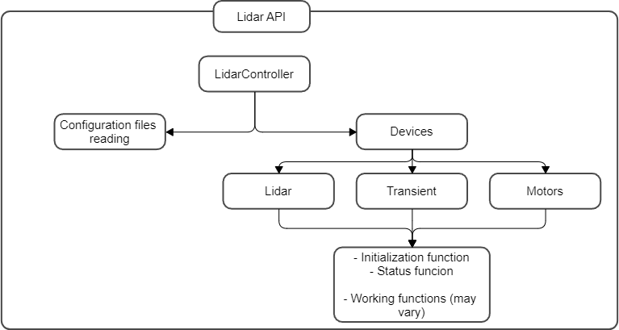

# Lidar API

Lidar API is an extensible software interface to Limon LIDAR. It is based on [FastAPI](https://fastapi.tiangolo.com/) and Object Oriented Programming.

# Table of Contents
- [Lidar API](#lidar-api)
- [Table of Contents](#table-of-contents)
- [How to run it?](#how-to-run-it)
- [How to use it?](#how-to-use-it)
- [Program Structure](#program-structure)
  - [Lidar controller](#lidar-controller)
- [Documentation per Device](#documentation-per-device)
  - [Motors](#motors)
  - [Licel](#licel)
  - [Laser](#laser)
- [How to...](#how-to)
  - [Implement nother controller](#implement-nother-controller)
  - [Create new controller routes](#create-new-controller-routes)

# How to run it?
Make sure to create a `.env` file in the root directory of the project and add the following variables:
```
MOTORS_PORT="/dev/ttyACM0"
```
Then, run the following commands:
```shell
$ pip install --user pipenv
$ pipenv install
$ pipenv run python main.py
```

A server will be running at `http://localhost:8000`.

# How to use it?
Once the API is running, you can use it by sending HTTP requests to the endpoints.

The API is available at `http://localhost:8000/docs` and `http://localhost:8000/redoc` for the interactive documentation.


# Program Structure
Lidar API is a wrapper for a lidar-controller. A piece of Python software that controls the lidar and exposes an API to interact with it, as follows:



The devices are extensible. For now only the motors are implemented, but extend to other devices is relatively easy.

Each device has a controller, which is a class that implements the device's logic. The controller is responsible for the communication with the device, and exposes a set of methods to interact with it. The common methods for all devices are `initialize` and `status`. 

## Lidar controller
Lidar controller is implemented at `src/controller`. Instantiate the Controller class and devices are added subsequently. For example, to instantiate the controller with the motors device:

```python
from controller import Controller
from devices.motors import Motors

controller = Controller()

controller.add_device("motors", Motors(controller))
```

# Documentation per Device

## Motors
For now, it is the only implemented device for now at `src/devices/motors`.

The class instatiation requires a two parameters. Port and baudrate. For example:
```python
from devices.motors import Motors

motors = Motors(controller, port="/dev/ttyACM0" baudrate=9600)
```

The specific motors controller methods are:

- `motors.send_string(string)`: Sends a string to the motors. The string must be a valid command for the motors. For example, `motors.send_string("CONF")` will execute the CONF command. Commands are defined in the pdf document [here](./assets/control-motores.pdf).
- `motors.receive_lines_str` and `motors.receive_lines_bytes`: Receive lines from the motors. The motors send lines of data, which can be received as bytes or strings. The method returns a list of lines received from the motors. It is usually used in conjunction with `motors.send_string` to retrieve the response from the motors.

## Licel

Despite Licel is not implemented. Some information has been gathered as a start point.

It communicates with a `TCP-IP` protocol. Thus, it is possible to use the `socket` library to communicate with it using the IP and port. For example:

```python
import socket

HOST = "127.0.0.1"
PORT = 2088

with socket.socket(socket.AF_INET, socket.SOCK_STREAM) as s:
    s.connect((HOST, PORT))
    s.sendall(b"runs\r\n")
    data = s.recv(1024)
```

A complete guide of the available commands is at page 18 from [Licel programming manual](https://licel.com/manuals/programmingManual.pdf). 

## Laser

Laser also use `TCP-IP` technology. So a controller could implement the same initialization as Licel. However, no documentation of the commands is available yet.


# How to...
## Implement nother controller
To implement another controller, create a new file at `src/devices` with the name of the device. For example, `src/devices/mydevice.py`. Then, create a class with the name of the device. For example, `MyDevice`. The class must inherit from `Device` and implement the abstract methods. For example:

```python
from .device import Device

class MyDevice(Device):
    def __init__(self, controller, port, baudrate):
        super().__init__(controller, port, baudrate)

    def initialize(self):
        # Initialize the device
        pass

    def status(self):
        # Return the status of the device
        pass
```

Finally, add the device to the controller. in the `src/devices/controller.py` file. For example:

```python
from controller import Controller
from devices.mydevice import MyDevice

controller = Controller()

controller.add_device("mydevice", MyDevice(controller, port="/dev/ttyACM0", baudrate=9600))
```

Remember to implement the methods `initialize` and `status` in every new device.

## Create new controller routes
To create new routes for a device, create a new file at `src/routes` with the name of the device. For example, `src/routes/mydevice.py`. 

Then, create a new router with the name of the device. For example:

```python
from fastapi import APIRouter

router = APIRouter()
```

The routes can have a desired behaviour for that specific path with the controller. For example:

```python
from fastapi import APIRouter

from src.controller import controller

router = APIRouter()

@router.get("/mydevice/status")
def get_status():
    return controller.get_device("mydevice").status()
```

Finally, add the new router to the main router at `src/router.py`. For example:

```python
from fastapi import APIRouter

from src.router.mydevice import router as mydevice_router

router = APIRouter()

router.include_router(mydevice_router, prefix="/mydevice")
```

